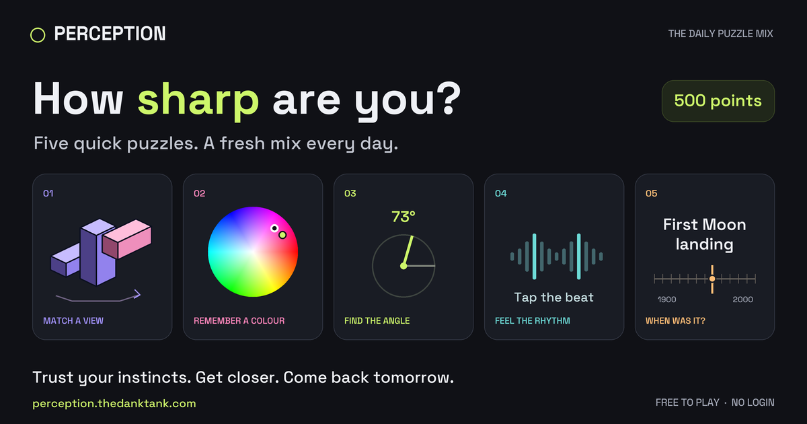

<p align="center">
  <a href="https://perception.thedanktank.com/">
    
  </a>
</p>

# Perception

**Five puzzles. 500 points. How close can you get?**

You know what a minute feels like. You can remember a colour. You can spot an angle.

…Right?

Perception puts that confidence to the test. Every day brings five different puzzles: rotate, trace, tap, slide, and guess your way to the answer. Sometimes your eye nails it. Sometimes your trivia saves you. Sometimes you are *way* off—and the reveal is half the fun.

### [Play today’s Daily Five →](https://perception.thedanktank.com/)

Free. No login. No downloads. No sound needed.

## Small questions. Big answer spaces.

| Puzzle | Your move |
| --- | --- |
| 🧊 **3D view** | Remember a view. Rotate the shape back into place. |
| ✂️ **Half & Half** | Cut a group of geometric shapes into two equal portions. How close can you get to 50/50? |
| ✍️ **Line memory** | Watch a path vanish. Trace it from memory. |
| 👁️ **Perspective** | Follow the lines to their vanishing point. |
| ▭ **Proportions** | Stretch a rectangle to match a ratio. |
| 🥁 **Rhythm** | Watch the pulse. Tap the tempo. Completely silent. |
| 📐 **Angles** | One number. A dial. Trust your eye. |
| 🎨 **Colour memory** | Remember a swatch. Find it on the colour wheel. |
| ⏱️ **Time awareness** | Start. Wait. Stop. How good is your internal clock? |
| 🗓️ **When?** | One event. Slide through history to find its year. |
| ⏳ **How long?** | Sport, space, films, everyday life. Turn the duration dial. |

## Your daily little reality check

- **One shared Daily Five.** Five different puzzle types, determined by your device’s date. Players on the same date get the same challenge.
- **Close counts.** Every round is worth 100 points. See your guess and the target together, then inspect small comparisons in your final results.
- **Compare with friends.** Share your Daily Five results as a compact scorecard with the date, puzzle emojis, and your total. No answer spoilers.
- **Practice when you feel like it.** Open the Practice menu for a fresh mix or an individual skill. Trivia practice draws from past Daily Fives, keeping upcoming questions out of the pool.
- **Pick your atmosphere.** Night Lab or Focus. Your choice sticks between visits.
- **Come back later.** Daily progress, streaks, and recent results stay in your browser. No account required; no cross-device sync.

The game opens straight into today’s challenge. It works on phones and desktop, with touch, mouse, and keyboard controls.

[How to play & scoring](https://perception.thedanktank.com/about.html) · [Play Perception](https://perception.thedanktank.com/)

## Under the hood

Perception is a static HTML/CSS/JavaScript game, hosted on GitHub Pages. Procedural puzzles use independent date-seeded generators. Trivia comes from a sourced question bank and a permanent daily schedule, so adding questions doesn’t rewrite published challenges.

Self-hosted fonts, a compact mobile layout, and two themes keep the puzzle front and centre. Minimal Umami analytics measure daily visits, starts, completions with scores, and one share-button click per browser per day.

Want to work on the game? Python and Node are needed for building and checks; players only need a browser.

```sh
python3 scripts/build-site.py
for test in tests/verify-*.cjs; do node "$test" || exit 1; done
python3 -m http.server 4175 --directory public
```

Open `http://localhost:4175/` to play your build. The complete playable site lives in `public/`; editable game sources live in `src/`.

[Maintenance & daily trivia](docs/MAINTENANCE.md) · [Analytics](docs/ANALYTICS.md)

---

**Your eye says “obviously.” The score says otherwise.**

[Give it a go →](https://perception.thedanktank.com/)
